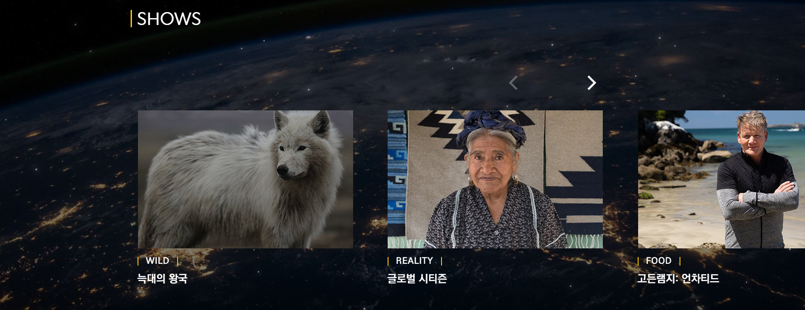

# NATIONAL GEOGRAPHIC Renewal
<내셔널지오그래픽> 홈페이지 리뉴얼

## 프로젝트 목표

JavaScript와 SCSS를 이용해 샐러드 브랜드 <내셔널지오그래픽> 홈페이지 리뉴얼

## 프로젝트에서 사용한 기술
### JavaScript ES6

jQuery 등의 라이브러리를 사용하지 않고 JavaScript 프로그램 작성

### SCSS 

7-1 패턴을 참고해 컴포넌트별로 나눠 작성했으며, main.scss에 임포트한 후 CSS로 컴파일

## 프로젝트의 기능 설명
### 스크롤 이벤트 
#### 내비게이션 스크롤 이벤트

* 스크롤을 내리면 내비게이션이 숨겨지는 기능
* 스크롤을 올리면 숨겨져있던 내비게이션이 다시 나오도록 작성

#### 컨텐츠 스크롤 이벤트
* 스크롤을 내리면 해당하는 섹션의 컨텐츠들이 등장하는 기능
* 스크롤의 양에 따라 애니메이션 class가 추가되는 JavaScript 작성

### 파티클 애니메이션

* 배경에 파티클을 랜덤으로 생성하는 기능
* 반복문과 Math.random()을 이용해 파티클의 크기, 위치, 애니메이션 duration과 delay를 랜덤으로 지정

### 버튼이 있는 이미지 슬라이드

* 화살표 버튼을 누를 때마다 한 칸씩 이동

> 이 프로젝트에서 쓰인 이미지와 동영상의 저작권은 NATIONAL GEOGRAPHIC에 있습니다.

